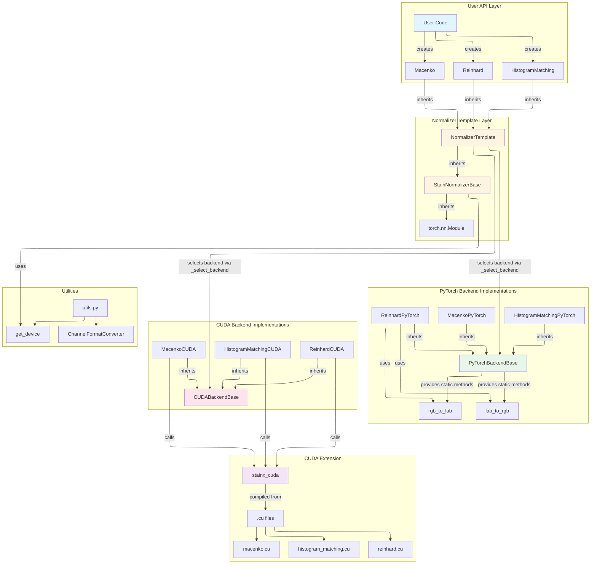

# StainX Architecture Diagram

## Complete Project Architecture

To render the architecture diagram below, simply view this markdown file on GitHub or any markdown viewer that supports Mermaid diagrams. The following diagram visualizes the major layers and components within the StainX project, showing how user-facing classes, template abstractions, backend selection logic, and both PyTorch and CUDA implementations interact, along with supporting utilities.

