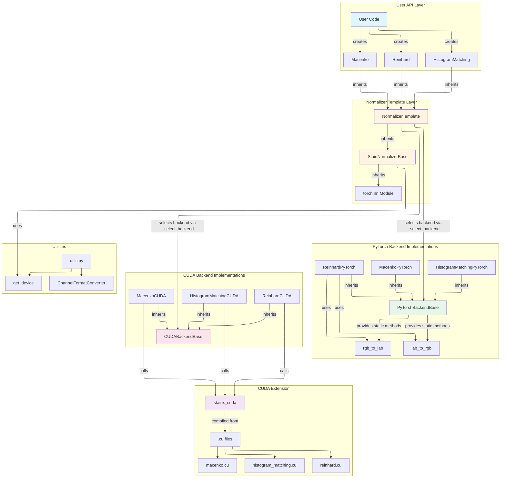

# Contributing to StainX

## Architecture

StainX uses a layered architecture with automatic backend selection:



**Key Components:**
- **User API**: `HistogramMatching`, `Reinhard`, `Macenko` classes
- **Template Layer**: `NormalizerTemplate` handles backend selection
- **Backends**: PyTorch (pure Python) and CUDA (optimized kernels)
- **Utilities**: Device detection, channel format conversion

## Contributing

### Development Setup

```bash
make install-dev  # Install with dev dependencies
make test         # Run tests
make lint         # Check code quality
make fix          # Auto-fix issues
```

### Adding New Normalization Methods

1. **Create normalizer class** in `src/stainx/normalizers/`:
   - Inherit from `NormalizerTemplate`
   - Implement `fit()` and `transform()` methods

2. **Implement PyTorch backend** in `src/stainx/backends/torch_backend.py`:
   - Inherit from `PyTorchBackendBase`
   - Implement algorithm in PyTorch

3. **Implement CUDA backend** (optional):
   - Add `.cu` file in `src/stainx_cuda/csrc/`
   - Add bindings in `src/stainx_cuda/__init__.py`
   - Create backend class in `src/stainx/backends/cuda_backend.py`

4. **Add tests** in `tests/`:
   - Test correctness against reference implementation
   - Test both PyTorch and CUDA backends

5. **Update documentation**:
   - Add usage examples
   - Update README if needed

### Code Style

- Python: Follow PEP 8, use `ruff` for linting
- C++/CUDA: Use `clang-format` for formatting
- Run `make fix` before committing

### Build the project

- To build the project (including the CUDA extension if you have CUDA available) `make build`
- This runs the package build process and compiles any C++/CUDA extensions. If you want to force a clean rebuild, run `make clean  build`
- Check the `Makefile` for additional commands.

### Testing Requirements

- All tests must pass: `make test`
- New features require tests
- CUDA tests should gracefully skip if CUDA unavailable

