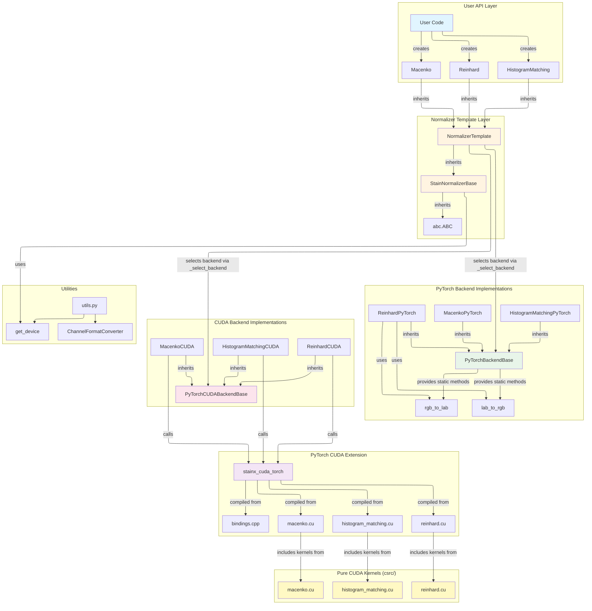

# Contributing to StainX

## Architecture

StainX uses a layered architecture with automatic backend selection:



**Key Components:**
- **User API**: `HistogramMatching`, `Reinhard`, `Macenko` classes
- **Template Layer**: `NormalizerTemplate` handles backend selection
- **Base Classes**: `StainNormalizerBase` and `NormalizerTemplate` are backend-agnostic (no hard PyTorch dependency)
- **Backends**: PyTorch (pure Python) and CUDA (optimized kernels)
- **Pure CUDA Kernels**: Located in `csrc/`, no dependencies, reusable by any CUDA interface
- **PyTorch CUDA Extension**: Wrappers in `src/stainx_cuda_torch/csrc/` that include pure kernels
- **Utilities**: Backend-agnostic device detection, channel format conversion

## Contributing

### Development Setup

```bash
make install-dev  # Install with dev dependencies
make test         # Run tests
make lint         # Check code quality
make fix          # Auto-fix issues
```

### Adding New Normalization Methods

1. **Create normalizer class** in `src/stainx/normalizers/`:
   - Inherit from `NormalizerTemplate`
   - Implement `fit()` and `transform()` methods

2. **Implement PyTorch backend** in `src/stainx/backends/torch_backend.py`:
   - Inherit from `PyTorchBackendBase`
   - Implement algorithm in PyTorch

3. **Implement CUDA backend** (optional):
   - Add pure CUDA kernels in `csrc/` (no dependencies)
   - Add PyTorch wrapper in `src/stainx_cuda_torch/csrc/` that includes kernels from `csrc/`
   - Add bindings in `src/stainx_cuda_torch/csrc/bindings.cpp`
   - Create backend class in `src/stainx/backends/torch_cuda_backend.py`

4. **Add tests** in `tests/`:
   - Test correctness against reference implementation
   - Test both PyTorch and CUDA backends

5. **Update documentation**:
   - Add usage examples
   - Update README if needed

### Adding New Backends

To add a new backend (e.g., OpenCL, Metal):

1. **Create backend base class** in `src/stainx/backends/`:
   - Inherit from a common interface or create new base class
   - Implement `__init__()` with device handling
   - Define required methods (e.g., `transform()`)

2. **Implement backend classes** for each normalizer:
   - Create classes like `HistogramMatching<Backend>`, `Reinhard<Backend>`, `Macenko<Backend>`
   - Inherit from the backend base class
   - Implement `transform()` method with algorithm-specific logic

3. **Update backend selection** in `src/stainx/normalizers/_template.py`:
   - Modify `_select_backend()` to detect and select new backend
   - Add availability check (similar to `CUDA_AVAILABLE`)

4. **Update normalizer classes**:
   - Add `_get_<backend>_class()` method in each normalizer
   - Update `_get_backend_impl()` to handle new backend

5. **Export backend classes** in `src/stainx/backends/__init__.py`

6. **Add tests**:
   - Test backend availability detection
   - Test correctness against reference implementation
   - Ensure graceful fallback if backend unavailable

**Note:** Currently, the `fit()` function executes only PyTorch routines. To improve flexibility and fully support all backends (such as CUDA), consider implementing backend-specific `fit()` logic so that fitting is performed using the selected backend, not just PyTorch. This will ensure consistency and performance across all supported backends.

### Code Style

- Python: Follow PEP 8, use `ruff` for linting
- C++/CUDA: Use `clang-format` for formatting
- Run `make fix` before committing

### Build the project

- To build the project (including the CUDA extension if you have CUDA available) `make build`
- This runs the package build process and compiles any C++/CUDA extensions. If you want to force a clean rebuild, run `make clean  build`
- Check the `Makefile` for additional commands.

### Testing Requirements

- All tests must pass: `make test`
- New features require tests
- CUDA tests should gracefully skip if CUDA unavailable

