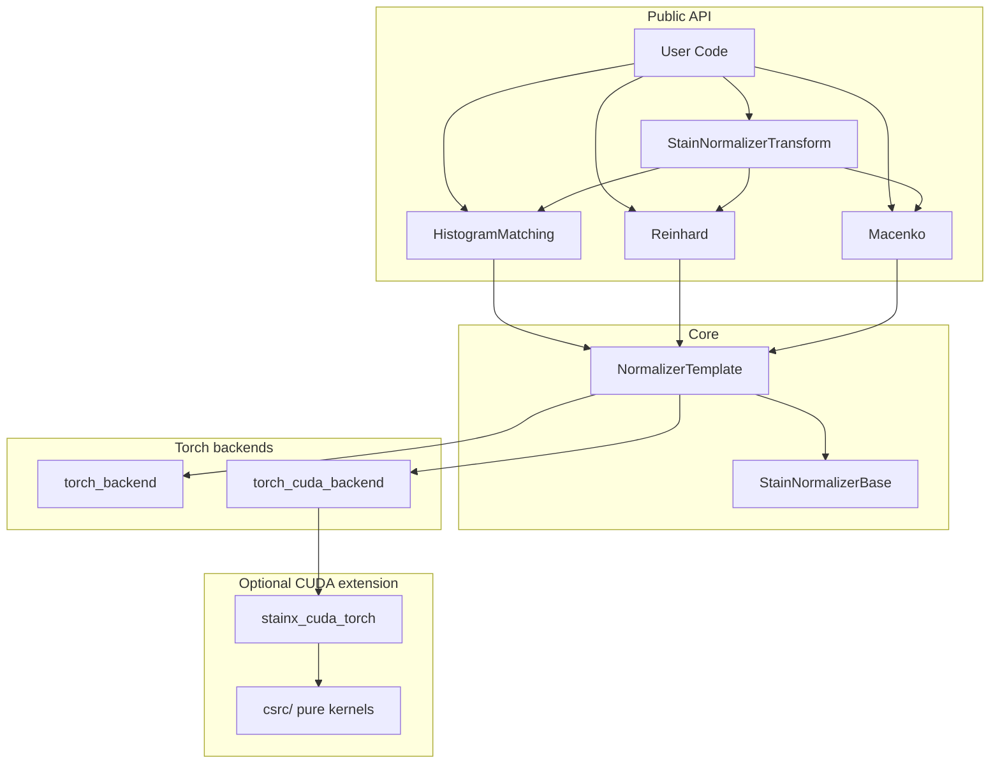

# Contributing to StainX

## Architecture

StainX is Torch-only with optional compiled CUDA kernels.


```mermaid
flowchart TB
  subgraph publicApi ["Public API"]
    User["User Code"]
    HM["HistogramMatching"]
    RE["Reinhard"]
    MA["Macenko"]
    XF["StainNormalizerTransform"]
  end
  subgraph core ["Core"]
    NT["NormalizerTemplate"]
    SNB["StainNormalizerBase"]
  end
  subgraph backends ["Torch backends"]
    PT["torch_backend"]
    PTCU["torch_cuda_backend"]
  end
  subgraph ext ["Optional CUDA extension"]
    SC["stainx_cuda_torch"]
    PURE["csrc/ pure kernels"]
  end
  User --> HM & RE & MA & XF
  HM & RE & MA --> NT
  XF --> HM & RE & MA
  NT --> SNB
  NT --> PT & PTCU
  PTCU --> SC
  SC --> PURE
```

### Layers

- **Public API**: normalizers + `StainNormalizerTransform`
- **Template**: backend selection (`torch` / `torch_cuda`)
- **Backends**: Python Torch ops; optional CUDA extension for Reinhard / HM / Macenko kernels
- **Shared kernels**: `csrc/` included by `stainx_cuda_torch` wrappers (Reinhard, HM, and Macenko cov/analytic eigh). Macenko’s ATen downstream pipeline stays in the Torch wrapper.

## Development setup

```bash
make install-dev
make test
make lint
```

## Adding a normalizer

1. Subclass `NormalizerTemplate`
2. Implement `_get_torch_class()`, `_get_torch_cuda_class()`, `_compute_reference_params()`, `_get_reference_params()`
3. Add Torch backend methods in `src/stainx/backends/torch_backend.py`
4. Optionally add CUDA kernels under `csrc/` + Torch wrappers under `src/stainx_cuda_torch/csrc/`
5. Add tests under `tests/torch_interface/` (and CUDA parity if applicable)

## Code style

- `make fix` / `make lint` (ruff + clang-format for CUDA sources)
- Prefer silent defaults (no print side-effects in library code)
